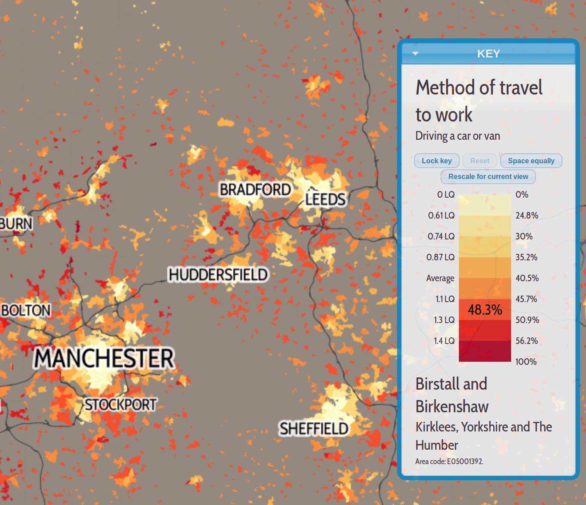
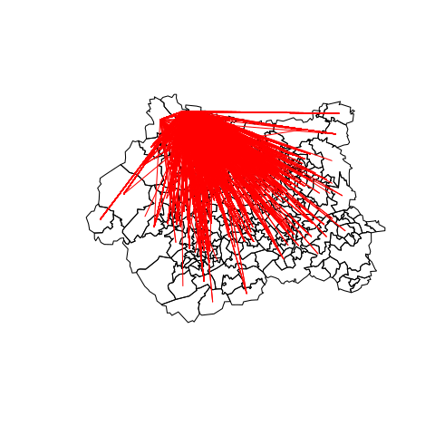
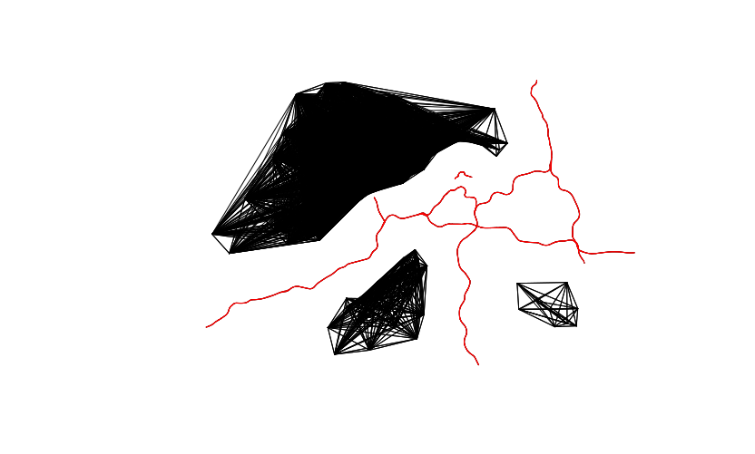
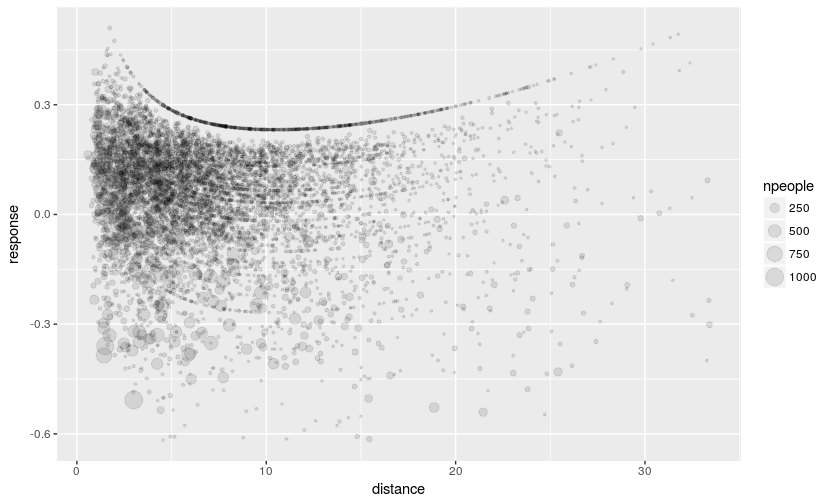
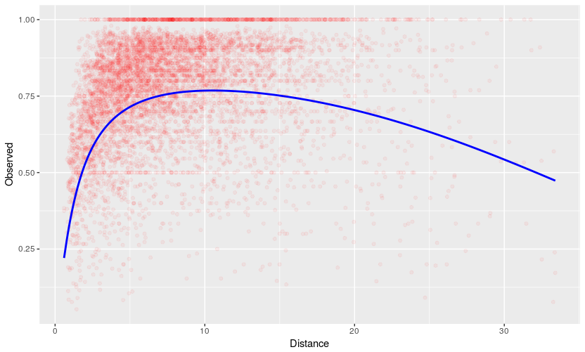
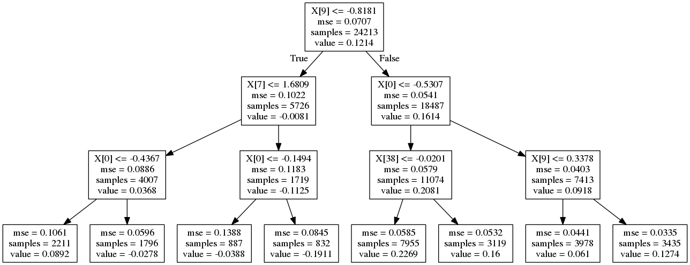
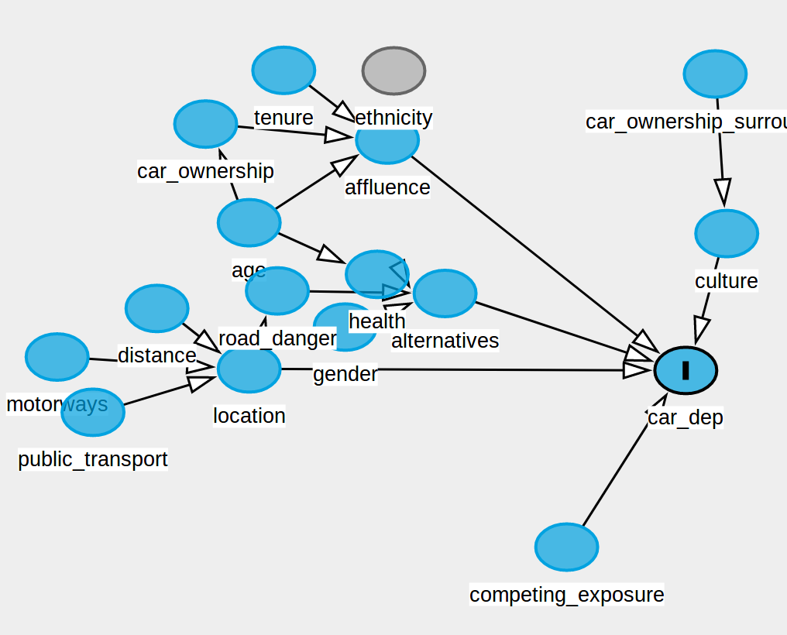

<!-- Detail: 25 minute presentation on our ml cars work on Thursday 31st -->

## Contents

> - Introduction
> - Data and Methods
> - Policy Implications

# Introduction

## Context

- Project title: *Using Machine Learning and Big Data to Model Car Dependency: an Exploration Using Origin-Destination Data*
- Submitted to the Transport Technology Research Innovation Grant (T-TRIG) funding stream
- Big data targetted call

Project outline: 

> - This project will explore the potential for emerging methods in Big Data and Machine Learning to be applied to transport modelling, with a focus on car dependency at the origin-destination level.

## Why car dependency?

- Little *government funded* research into the issue (based on internet search)
- Yet high impact (economic, social, environmental)
- And builds on prior work with the PCT [@lovelace_propensity_2017]


## A personal definition of car-dependency

> If for some reason you could not longer use a car, would you find it... really inconvenient more or less every day never?

- Source: [@anable_complacent_2005]


## Evidence-based measures of car dependency

Simple measures:

- Percent driving to work
- Number of cars per household
- Road traffic data
- Road casualties

Complex measures:

- Numbers who *could* have used another mode
- People who could not get to work 'if the oil ran out' (Philips 2015)

## Modal split | Source: [datashine](http://datashine.org.uk/#table=QS701EW&col=QS701EW0008&ramp=YlOrRd&layers=BTTT&zoom=13&lon=-1.4710&lat=53.7238)

```{r, echo=FALSE}

```


## Outputs

- A demonstration of how official datasets can be augmented with geographical data from OpenStreetMap.

- An application of Machine Learning algorithms to widely available transport datasets.

- A tutorial on Big Data and Machine Learning targetted at transport planners, consultants and policy-makers relatively new to data science.

- Write-up of the policy implications of the research.

- An R package, **mlCars**, containing the source code, example data and reports to ensure reproducibility. The package can be accessed here: https://github.com/Robinlovelace/mlCars/

## What is big data?

Big data is an umbrella term. We define it as:

> "**unconventional**  datasets  that  are  **difficult**  to  analyze
**using established methods**. Often this difficulty relates to **size** but the form, format, and **complexity** are equally important" [@lovelace_big_2016]. 

```{r, echo=FALSE, fig.width=3}
knitr::include_graphics("https://openclipart.org/image/300px/svg_to_png/170637/1339577112.png")
```

## What is machine learning?

> By machine learning, we mean simply that the functional form of the model is not specified by the user. 

> There are two main types of machine learning [@hastie_elements_2016]:

supervised or unsupervised. In supervised learning, the goal is to pre-
dict the value of an outcome measure based on a number of input measures;
in unsupervised learning, there is no outcome measure, and the goal is to
describe the associations and patterns among a set of input measures.

> Many transport problems can be framed as supervised Machine Learning problems.

# Data and methods

## Official, open access data

- Origin-Desination (OD) data
- Geographically aggregated socio-demographic data from the 2011 Census

```{r, echo=FALSE, out.width="70%"}

```

## OSM data
- Spatial data from the OpenStreetMap API and the NAPTAN dataset

```{r, echo=FALSE, out.width="70%"}

```
## Response variable



## Classical statistical methods

- Descriptive Statistics
- Visualisation
- Linear Regression

```{r, echo=FALSE, out.width="70%"}

```

## Machine Learning

- Python and R for Machine Learning
- Random Forest and Boosted Regression Trees (xgboost)
- Theano, Spark, TensorFlow

```{r, echo=FALSE, out.width="70%"}

```

## Directed Acyclic Graphs (DAGs)

Directed Acyclic Graphs (DAGs) were used to explore causality between the variables. 

Tricky to create the DAG and implement - Rob Long.

```{r, echo=FALSE, out.width="70%"}

```

# Policy implicaitons

## Machine Learning and Big Data for the Transport Sector
- Machine Learning and big data present new opportunities for the transport sector.

- Big data and Machine Learning offer the promise of more efficient and cheaper transport models based on rich, finely-grained data across a wider range of indicators.

- However, they should not supplant domain expertise or contextual knowledge in transport policy and planning. They are best used as aides to human decision-making rather than replacements.

- Barriers to the effective and ethical uptake of innovative new technologies in transport include: access to skills, investment in R&D and organisational culture.

## The Policy Implications of Car Dependency
- Car dependency is the cause of a variety of social, environmental and economic issues in West Yorkshire. 

- Creating more sustainable regions by reducing car dependency and developing multi-modal mobility requires a multi-faceted approach that involves both ‘hard’ and ‘soft’ policy interventions.

## Contact
Robin Lovelace - Institute for Transport Studies (ITS), University of Leeds.
Email: r.lovelace@leeds.ac.uk

Liam Bolton - Red Ninja / University College London.
Email: liamthomasbolton@gmail.com


## References

