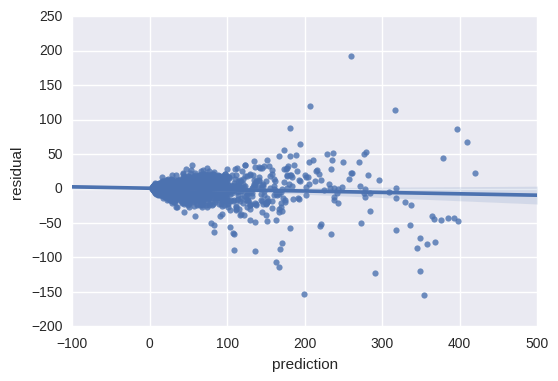
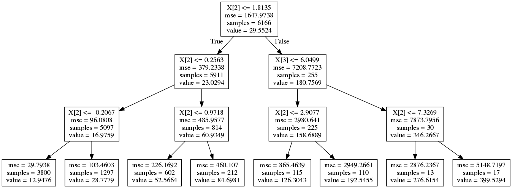

```{r}
knitr::opts_chunk$set(echo = FALSE, message = FALSE)
devtools::install_github("robinlovelace/mlCars")
library(mlCars)
wyflows = readRDS((system.file(package = "mlCars", "data/wyflows.Rds")))
```


<!-- From a policy perspective car dependency is problematic due to its negative consequences, not in its own right.  -->
<!-- Notwithstanding questions of whether government policy encourages car dependency,  -->


<!-- It is important to note that car dependency is not necessarily  -->

# Introduction

The primary purpose of this project is to show the power and potential benefits of machine learning for transport data analysis and policy development. By demonstrating previously impossible or inaccessible methods we aim to show how new techniques, combined with new and newly open datasets, can generate a strong evidence base for transport planning and policy. The aspiration is that the work will filter into policies, to make them data-driven, transparent, reproducibible and encouraging of citizen science and innovation.

It is important to understand what we mean by the terms Big Data and Machine Learning, so some definitions are in order. We take a broad view of both. By Big Data we mean "unconventional datasets that are difficult to analyze using established methods" [@lovelace_big_2016]. Thus we are not necessarily talking about size. It's also about data that are unconventional in terms of "form, format, and complexity", making them difficult to analyse using a spreadsheet, for example. By machine learning, we mean simply that the functional form of the model is not specified by the user, but by an algorithm which uses trial and error to find the most appropriate model. A model is simply a mathematical or computer-encoded representation of a phenomenon (in this case car dependency), so the techniques outlined in this report could apply to a wide range of transport (and non transport) issues: car dependency is a useful, and highly policy relevant, case study to illustrate what is now possible and potential future directions of travel.

This report summarises the work undertaken over the course of a 3 month project funded by the UK's Department for Transport (DfT) under the Transport Technology Research Innovation Grant (T-TRIG) stream. This funding stream is part of the Chief Scientist's [office](https://www.gov.uk/government/people/phil-blythe), which, among other things "helps develop the department’s links with the wider science, engineering, technology and innovation community".

The report is self-standing but links to 4 Appendices, which can be consulted for futher details on the input data, methods and policy implications of the research, respectively. They are:

- Progress Report 1, which is focussed on the input data and data generation process and how official datasets were augmented with geographical data from OpenStreetMap.

- Progress Report 2, which describes the Machine Learning algorithms used and provides code snippets and results to show how they performed.

- The Policy Implications of the research, which provides an up-to-date account of the state-of-the-art in terms of machine learning in public policy.

- A tutorial on Big Data and Machine Learning for transport data analysis which explains how to use some of the methods outlined in this report, targetted at transport planners, consultancies and policy-makers relatively new to data science.

## Car dependency: motivations and definitions

It is well-known that car dependency is close to the root of many problems that are exacerbated by the transport system, economic, environmental and social. However, car dependency is a complex phenomena linked to multiple interrelated factors, the root causes of which are not well understood. This makes it an ideal topic for investigation by machine learning. Therefore, beyond the methodological insights gained by this project, we hope that the results lead to policies that are more evidence-based and effective that decisions based on basic indicators, intuition, and experience alone.

Car dependency should be easy to define: a measure of the extent to which people *depend* on their cars.
But what does this actually mean?
Unless your car doubles as a life-support system, it is unlikley that you literally depend on it for survival.
More likely you depend on the car for trips that are *seen as essential*, for modern life.
Whether it's for doing the 'weekly shop', dropping children off at school or taking a sick relative to hospital at an affordable, car use can easily become integral modern life.

<!-- Of course, each of these trips could have either been made by a different mode or not made at all and (except potentially in the case of taking a relative to hospital) nobody would die. -->
<!-- Car dependency is thus about observed behaviour than hypothetical consequences of going *cold turkey*. -->
<!-- The analogy of a drug dependency is useful. -->
<!-- Drug dependents will not die if they can no longer indulge their addition. -->
<!-- But life will be hard, at least for a while after, when they stop. -->
<!-- Similarly, those who are car dependent will find it hard to adjust to life after their car has been taken away. -->

What is actually meant by car dependency in the context of machine learning?
There are many possible ways of defining and measuring car use.
@anable_complacent_2005, for example, defines car dependency in attitudinal terms
The paper is also relevant methodologically, illustrating the potential benefits of applying cluster analysis, then a new method, to the question of 'car addicts' as the author puts it.
In this work we interpret car dependency as more about current behaviour than hypothetical future behaviours. Specifically, we define car dependency as:

> The proportion of people in a zone or along a particular desire line who drive, or are passengers in a car or van, as their main mode of transport, taking account of the distances of those trips.

By 'taking account of the distances of those trips' we mean that a zone in which 50% of the population use a car for trips of 5 miles is more car dependent than a zone in which 50% of the population uses a car for trips of 20 miles. We define car dependency *relative to distance* because the policy motivation of this project is to help identify zones and routes where interventions could reduce car dependency. It is easier to intervene to reduce car use for 5 mile trips (e.g. by providing good walking and cycling facilities) than for 20 mile trips (e.g. by creating new bus routes or public transport stations).

The importance of the spatial element in car dependency was highlighted in a recent article by @clark_temporal_2017, who found that an area's likelihood of becoming or remaining car dependent was greatly increased if surrounding areas had high levels of car ownership. This work was made possible by recent methodological developments, illustrating how new approaches to existing methods, and data, can yield new policy insights. 
Before progressing to explore the methods, it is vital to understand the input data.

## Input data

During the first stage of the project (2017-02-06 to 2017-03-20) the priority was to access and organise the data.
Data preparation may not sound like exciting work, but it can consume a large proportion of analysts' time, so is worth taking seriously [@gillespie_efficient_2016; @grolemund_r_2016].
Big data and machine learning offer the promise of more efficient and cheaper transport models based on rich, finely-grained data across a wider range of indicators. 
As outlined in the Policy Report, the rise of open data and shared data has also enabled the development of more transparent and accessible transport tools and models. Drawing exclusively on datasets that are free, publicly-available and ‘big’, this research demonstrates a more open, innovative methodology for transport mobility.


For simplicity and maximum accessibility this project uses only datasets which are open (publicly available). There are three main input dataset types:

- Origin-destination (OD) commute data from the 2011 Census data.
- Geographically aggregated socio-demographic data from the 2011 Census.
- Geographic variables associated with each OD pair.

The Census was used as the primary input dataset because it provides so many variables relevant to car dependency. To our knowledge, the breadth of input datasets have never been analysed together in a single project.

The case study region used for this project was **West Yorkshire**. This case study was selected due to the wide range of social and geographical environments linked to car dependency found here: it includes rural, urban, deprived and privaledged areas.

### Origin-destination data

The fundamental input dataset was a table reporting the number of people travelling, by main mode of transport, commuting to work between Middle-Super Output Areas (MSOAs, average population: ~7,500). This is an open dataset ([available online from the official WICID data portal](http://wicid.ukdataservice.ac.uk/)) (dataset WU03EW). The file was downloaded as `wu03ew_v2.zip`, an 11.8 MB zipfile which when unzipped creates the file 109 MB plain text file `wu03ew_v2.csv`.

The result is a data frame the first two columns of which contain a the code for the MSOA of origin and destination, respectively. The subsequent columns report number of people whose main mode of travel to work was:

- work at home (no transport used)
- some form of metro
- train
- bus or coach
- taxi
- motorcycle or scooter
- drive a car or van
- passenger in car or van
- bicycle
- walk
- other

We grouped together people who drive or are passengers to estimate car dependency. Further, we filtered out flows with an origin or destination outside West-Yorkshire, resulting in **53,807** OD pairs in the study region. This amount of data is sufficient for machine learning algorithms to work and extract complex insights, but small enough for experimentation and fast iteration of methods.

To convert the non-geographical OD dataset into geographic data we used the function `od2line()` from the **stplanr** R package [@lovelace_stplanr:_2017]. The result is straight lines that can be plotted on the map and about which geographical variables, such as proximity to motorways, can be extracted.

```{r, echo=F, out.width="49%", fig.show='hold', fig.cap="A sample of work commute flows in the West Yorkshire region (left), and a sample of the result of the code which calculates the distance between motorways (red) and flows (black), in this case discarding all flows within a certain distance of the motorway, as an example."}
knitr::include_graphics(c("../figures/flows_500_westyorkshire.png", "../figures/dist_motorways.png"))
```

We will hereon refer to each home-work (origin-destination) pair and its corresponding number of commuters, in geographic form, as a *flow* (see Figure 1).

To this base table there are two ways to further increase the data included for modelling: the Census provides numerous other demographic and economic measures and indicators which can be linked to the commuter's home MSOA ([available here](https://www.nomisweb.co.uk/census/2011/data_finder)), and it also provides workplace data which a group of researchers at the University of Southampton have conveniently created a classification of (by work type, [available online as well](http://cowz.geodata.soton.ac.uk/download/)) which can be linked to the workplace MSOA.

### Socio-demographic data

The geodemographic data relevant to each origin (home) MSOA consists of the following variables: number of people in particular age brackets, number of people of each gender, car or van availability (including number of homes with 0,1,2,etc. cars), population density, number of economically active and inactive people, general health (number of people with very good, fair, etc. general health), number of people per ethnicity group, number of people by maximum qualification level, and lastly, average number of rooms, bedrooms and fraction of homes with central heating (see Appendix 1).

### Spatial data

In addition to this Census data we gathered and computed spatial data as well. We have obtained the location of motorways through the [OSM API](https://osmdatar.github.io/osmdata/articles/osmdata.html), and the positions of train stations, coach stations, and bus stops from the [NAPTAN dataset](http://naptan.app.dft.gov.uk/datarequest/help). This allowed us to calculate geographical distances between flow lines and motorways, train stations, coach stations, and bus stops. This proximity and accessibility data is arguably vital to best understand and model car usage propensity, and has for the first time become readily available via the OSM platform, and analysis of the type we aim to do next should be cutting-edge data analysis.

The input data are described in more detail in Appendix 1.

<!-- \newpage -->

<!-- ### Overview of input data -->

<!-- A list of the variables used in the input dataset for the machine learning algorithms is provided below. -->

<!-- ```{r variablestable, echo=F, message=FALSE} -->
<!-- df = readr::read_csv("../Table_of_variables.csv") -->
<!-- df$Description = strtrim(df$Description, width = 78) -->
<!-- knitr::kable(df, caption="The variables in the full dataset.") -->
<!-- ``` -->

<!-- \newpage -->

<!-- ## Preparing the target variable: removing distance-dependence -->

<!-- From the outset one can foresee that out of our dataset one of the most important variables in predicting car dependency will be the distance between the origin (home MSOA) and the destination (workplace MSOA). However given our stated aim of better understanding the driving factors behind car dependency for policy decision-making purposes, distance is not something we can alter by policy and it is therefore of secondary interest, as mentioned in our definitioni of car dependency above. In order to prevent our models from focussing on distance dependence we would therefore like to remove the distance-dependence of the car fraction data as best as possible. -->

<!-- We do this by using a model to fit the distance dependence of the car fraction, ensuring it has a good fit to the data, and then subtracting from the observed car use fractions the car use predicted by the model. The result of this is a variable which has a much diminished distance-dependence, and it is this variable which we will then apply machine learning to model in the next stage. -->

<!-- The model which best fit how the car use fraction varies with distance turned out to be a logistic regression model fit on the mean car fraction by 1km distance band (i.e. a curve where the first point is the average car use fraction for distances of 0-1km, etc.) using the distance and the natural logarithm of the distance as input variables (Figure 2). -->

<!-- After subtractin the car fraction predicted by the model from the observed car fraction we obtain a variable which a much reduced dependence on distance (i.e. it is centred on zero and does not significantly increase or decrease with distance), as shown in Figure 3. -->

<!-- Now that we have approximately removed the dominant influence of the distance, we can proceed to use machine learning to tease out the patterns in the data from all the other more subtle variables.  -->

<!-- ```{r, echo=F, out.width="49%", fig.show='hold', fig.cap="The model fit obtained for car useage fraction as a function of distance. The fit against the mean by distance band is shown on the left, and the fit against all data points is shown on the right."} -->
<!-- knitr::include_graphics(c("../figures/dist_fit_mean.png", "../figures/dist_fit.png")) -->
<!-- ``` -->


<!-- ```{r, echo=F, out.width="49%", fig.show='hold', fig.align='center', fig.cap="The variable obtained by subtracting predicted car fraction from observed car fraction."} -->
<!-- knitr::include_graphics("../figures/response.png") -->
<!-- ``` -->

<!-- ## Next steps -->

<!-- Based on the input data documented in the previous sections, we have already made a start on developing and running code to identify the variables associated with car dependency. To do this we will perform model selection of a wide range of machine learning regression models, checking their performance in prediction car dependency (car use fraction as defined above) on a new dataset. -->

<!-- Once the best-performing model has been found we will do some model validation to ensure the model gives sensible predictions on new data, and then proceed to attempt to extract which variables the model deems most important in predicting car dependency, in general, or if possible also for individual predictions. -->

# Visualisation and traditional statistical analysis

Visualisation and descriptive statistics are tried and tested techniques for understanding data. The importance of gaining an overview of the data is heightened for large and complex datasets that will be analysed using machine learning, because errors can have large un-intended consequences, that may be hidden by the 'black box' nature of the algorithms.

For analysis aimed at informing locally targetted interventions, maps are an excellent starting point. Even though the data operate at a high geographical resolution (at the OD level), it is worth starting with visualisations at a low level of detail, to ensure that the data makes sense.

```{r highdependency, message=FALSE, fig.cap="Flows in West Yorkshire in which a high proportion of trips (95%+) of trips are made by commuting, for flows along which which 30+ people overall commute."}
library(dplyr)
library(sp)
library(tmap)
tmap_mode("view")
wyflows$all = apply(wyflows@data[3:11], 1, sum)
wyflows$pcar = wyflows$car / apply(wyflows@data[3:11], 1, sum)
wyflows_big = wyflows
wyflows = wyflows[wyflows$all > 30,]
sel_95 = wyflows$pcar > 0.95
qtm(wyflows[sel_95,], lines.lwd = "all", lines.col = "pcar", scale = 20)
```

Figure 2 shows the benefits of converting the data into a spatial format.
It shows that car dependency is a problem across West Yorkshire, with particular issues in the suburbs between Leeds and Bradford and in rural areas such as Ripon in which there are comparatively few job opportunities.

Another way to visualise the same data is in terms of absolute numbers of people using the car (Figure 3).

```{r, fig.cap="Visulisation of the most flows in West Yorkshire in which over 100 people travel to work by car. Red lines have a higher percentage travelling by car, wide lines have a higher overall number of people travelling by car."}
sel_100 = wyflows$car > 100
sel_od = wyflows$homeMSOA == wyflows$workMSOA
qtm(wyflows[sel_100 & !sel_od,], lines.lwd = "car", lines.col = "pcar", scale = 20)
# summary(rgeos::gLength(wyflows[sel_100 & !sel_od,], byid = T))
```

Figures 2 and 3 demonstrate the importance of decisions around visualisation. Both plots are useful in that they provide a high level overview of the issue. However, despite our definition of car dependency in proportional terms, Figure 3 is probably more useful. It shows how small changes to visualisation options (in this case visualising only flows with a high absolute number of car drivers, > 100, and setting width proportional to the same variable) can have a great impact on how the data is interpretted.

Figure 3 shows that each settlement has car dependency issues. However, they are different in nature, with Leeds suffering from high car use primarily due to high numbers of commuters but with smaller settlements having both high numbers and high proportions of people driving to work. Another difference compared with Figure 2 is that Figure 3 clearly shows that in terms of absolute numbers, short car trips dominate: the average distance of flows in which 100+ people drive is less than 5km straight line distance.

Many linear regression models were run to explain the variability in the number of people driving to work. This code is presented in the file [`vignettes/traditional-stats.Rmd`](https://github.com/Robinlovelace/mlCars/blob/master/vignettes/traditional-stats.Rmd) but not discussed further in this document as the focus of the project is on Machine Learning.^[Thanks
to Rob Long for undertaking the statistical analysis using traditional linear regression techniques.]
Suffice to say that the 'features' of greatest importance according to Machine Learning (particularly age) cooincided with the most statistically significant explanatory variables. This suggests that traditional statistical techniques should be used along-side machine learning techniques to ensure understanding of the data and cross-checking of results.


# Machine Learning

Appendix 2 demonstrates and explains the Machine Learning methods that have been applied to the input data. The Python code underlying this work, and the results generated, are available in IPython notebooks (`.ipynb` files) called [`Regression_toolkit.ipynb`](https://github.com/Robinlovelace/mlCars/blob/master/Python/Regression_toolkit.ipynb) and [`Deep_MLP.ipynb`](https://github.com/Robinlovelace/mlCars/blob/master/Python/Deep_MLP.ipynb). These are stored in the Python folder of the [mlCars](https://github.com/Robinlovelace/mlCars) GitHub repository. To ease accessibility, GitHub renders these files so they are human readable on its interface - see https://github.com/Robinlovelace/mlCars/blob/master/Python/Deep_MLP.ipynb an example of this.

The overall finding was that there is a very wide number of software pacakges, in both R and Python.
Python was used for the majority of the Machine Learning work because the analyst working on the project had most experience in this field, but either can be used.
For very large scale data, specialist software may be necessary, such as Theano [@the_theano_development_team_theano:_2016], Spark [@meng_mllib:_2016] or TensorFlow [@abadi_tensorflow:_2016]. Fortunately, high level interfaces to such 'low level' Machine Learning programs have been developed in both R and Python, such as the **kerasR**, **tensorflow** and [**sparklyr**](https://github.com/rstudio/sparklyr) packages. 

A demonstration of the Theano approach is demonstrated in Appendix 2. While this proof-of-concept is useful, it did not provide results that were more useful than the simpler algorithms used in ealier sections of that report. In the context of the comparatively small dataset size and simplicity of the problem (compared with machine translation and image recognition), using systems such as Theano on this particular tasks is probably overkill. Metaphorically speaking it's like using a machine gun to swat a fly.

On the other hand, simpler techniques such as random forest and boosted regression trees (as implemented in the package **xgboost**) are easy to set-up and run. Perhaps too easy. It is vital that users understand at least some of the theory underlying the code to ensure appropriate input parameter and interpretation. One advantage of **xgboost** is that it prevents 'overfitting' and deals well with co-linearity, highly correlated predictor variables.

One interesting and somewhat unexpected finding from the Machine Learning experience was that the results in terms of feature importance were sensitive to both the algorithm used and the set-up of the model run.


<!-- Progress Report 1 describes the construction of the explanatory variables and definitions of the dependent variable. This second Progress Report describes the work we have done to model the input data using Machine Learning. -->

<!-- The first step in this process is that of model selection by cross-validation, and it is this procedure which we will now describe. The first step of model selection is to choose the metric of interest, based on which we will select the best-performing model. Given that this is a regression problem there are multiple possible metrics: mean squared error (MSE), mean absolute error, coefficient of determination ($R^2$), etc. From the point of view of policy decision-making, which is our ultimate goal, there is no clear choice of best-suited metric. We have chosen the coefficient of determination as it seems to be the metric of interest for our Data Science contact at the Department for Transport, but it must be noted that this metric is ill-suited for the mostly non-linear [^1] regression models we consider (see for example [@spiess2010evaluation]). -->

<!-- [^1]: For clarity, we are referring to non-linearity in the regression parameters, models non-linear in the covariates (e.g. the Elastic Net model we use) are still linear by this definition. -->

<!-- Having chosen the metric of interest, we proceed to shuffle and split the data in preparation for cross-validation. Flows are unordered data and therefore can be shuffled uniformly with no problem. We shuffle the flows in the West Yorkshire dataset, and then split off half of the data for model selection and validation, the other half is left for final model testing to estimate the generalisation error (or parts of it may used for further model selection, e.g. parameter tuning, if needed). -->

<!-- We then perform 10-fold cross-validation on the validation half of the dataset. At this point we do not perform any hyperparameter tuning and use the default parameters set in scikit-learn's implementation [@scikit-learn] of these algorithms[^2]. The regression models considered and the result of the model selection are shown in the table below. -->

<!-- [^2]: Grid search or random search hyperparameter tuning by cross-validation could be carried out at a later date on a separate dataset for a subset of the selected models to extract further gains in predictive performance. -->

<!-- ```{r modelseltable, echo=FALSE, message=FALSE} -->
<!-- df = readr::read_csv( -->
<!-- 'Model, $R^2$ -->
<!-- MLP, 0.95480664571211638 -->
<!--  XGB, 0.95221782699878565 -->
<!--  RandomForest, 0.94110527517837894 -->
<!--  ExtraTrees, 0.93660428365175041 -->
<!--  ElasticNetCV, 0.92687784055607514 -->
<!--  PassiveAggressive, 0.88703967983492982 -->
<!--  DecisionTrees, 0.87369739490295328 -->
<!--  TheilSen, 0.85617625169566003 -->
<!--  KNeighbors, 0.8427571341143999 -->
<!--  RANSAC, 0.77661470618074036 -->
<!--  --MEAN MODEL--, 0.0 -->
<!--  Dummy, -0.00037522330595122594 -->
<!--  SGD, -1.2113190001068818e+23 -->
<!-- ' -->
<!-- ) -->
<!-- knitr::kable(df, caption="10-fold cross-validation $R^2$ scores of the the regression models considered. The `MEAN MODEL` is a model which always predicts the mean of the response variable, and is included as a reference point and benchmark. The RANSAC and Stochastic Gradient Descent (SGD) regressors have clearly not converged but we will not attempt to tune them for now. ") -->
<!-- ``` -->

<!-- Without engaging in extensive hyperparameter tuning on a separate dataset, we see that the Multi-Layer Perceptron and the XGBoost regressor [@Chen:2016:XST:2939672.2939785] top the list with $R^2 \approx 0.95$. The difference between the top-performing models is likely not significant, therefore on theoretical grounds we will choose the XGBoost regressor as our tentative final model, as boosting is known to be less likely to overfit [@schapire1999brief], and therefore is likely to generalise best to new datasets. We will therefore select it as a tentative final model and now proceed to perform some model validation to ensure its predictions are sensible. -->


<!-- ### Model validation -->

<!-- For a regression task such as the one at hand, the model validation checks which can be performed are perhaps less intuitive than the tests available for classification tests. However some basic plots of the model's predictions and checks of the model's residuals and the correlation of the model's predictions with observed values can and should be carried out. -->

<!-- The figure below shows the residuals of the XGBoost regressor on a validation dataset, showing no obvious trend or asymmetry which would be indicative of a poorly-fit model. -->

<!-- ```{r, echo=F, out.width="49%", fig.show='hold', fig.align='center', fig.cap="The residuals of the XGBoost regressor on a validation dataset."} -->
<!--  -->
<!-- ``` -->

<!-- We can further inspect the distribution and correlation of the predicted and observed values, as well as a histogram of their distribution. -->

<!-- ```{r, echo=F, out.width="49%", fig.show='hold', fig.align='center', fig.cap="The distribution and correlation of predictions and observed values."} -->
<!-- knitr::include_graphics(c("../figures/xgb_pred_obs_correlation.png", "../figures/xgb_hist.png")) -->
<!-- ``` -->


<!-- #### A note on data cuts and variable forms -->

<!-- Two cuts on both the rows and the columns of the dataset were found to be necessary during the machine learning model-fitting procedure. In terms of the variables used it is important to note that --much like with categorical variables in an Ordinary Least Squares-type linear regression-- most of our variables are fractions, and therefore if we have $n$ columns which sum to $1$, we in effect only have $n-1$ independent features, as once $n-1$ of the entries on a given row are known, the last one can be deduced to be 1 minus the sum of the other $n-1$ columns. As such including all $n$ columns induces multicollinearity. In order to manage this we drop one such column (preferably the one which we expect to be least dominant) and include only the other $n-1$ columns, which should now have no strong correlations induced by normalisation. -->

<!-- One important cut was required to reduce the noise in the dataset. Flows with low numbers of total commuters introduce artifacts in the response variable, such as inflation at values corresponding to exact fractions with a low denominator (e.g. $\frac{1}{2}$, $\frac{1}{3}$, etc.). These artifacts from low sample sizes are not representative of global behaviour and may complicate or skew the model-fitting process, resulting in models with poorer generalisation performance. We therefore chose to drop flows with less than 10 commuters, in doing so removing low-sample artifacts and improving model fit. -->

<!-- Consideration of both the variables to be included and potential redundancies or multicollinearity between them, as well as low sample-size artifacts and their removal must therefore be carefully undertaken at the earliest stage, ideally at the data preparation stage, or during model selection, as soon as they are identified.  -->

<!-- **A further important point to make regarding the form of the variables fed into the models is that the use of ratios should be entirely avoided, with the use of raw counts always being preferable. This is due to the fact that using ratios of random variables induces strong spurious correlations [@atchley1976statistical] which may hurt predictive performance, but more importantly, will skew measures of relative variable importances.** -->


<!-- ### A Deep Learning model -->

<!-- For completeness, we would be remiss if we did not consider fitting a deep learning model, particularly since the Multi-Layer Perceptron performed well during the previous model selection stage, considering a neural network model with further hidden layers is fully justified. We have constructed a 3-hidden layer Multi-Layer Perceptron (MLP) using the Theano [@2016arXiv160502688T] Python package. The MLP implementation in scikit-learn includes only a single hidden layer, therefore there is value in exploring potential predictive performance gains by considering deeper neural networks. -->

<!-- Numerous contemporary training methods were implemented to enable the successful training of this neural network, including unsupervised pre-training of the layers by Stacked Denoising Auto-encoders [@vincent2010stacked], orthogonal weight initialisation [@2013arXiv1312.6120S], dropout regularisation [@srivastava2014dropout], $L_1$ and $L_2$ regularisation, ReLu activation units, etc. This allowed the neural network to be properly fit over hundred of epochs (passes over the training data), with no sign of significant overfitting, as shown in the training and validation errors in the figure below. -->

<!-- ```{r, echo=F, out.width="49%", fig.show='hold', fig.align='center', fig.cap="The MSE on the training and validation sets as training of the MLP progresses."} -->
<!-- knitr::include_graphics("../figures/nn_training.png") -->
<!-- ``` -->

<!-- A deep learning model was therefore successfully fit, with a sensible residual plot and distribution of predictions. However its performance was still below that of the XGBoost regressor previously selected, with a coefficient of determination of $R^2 \approx 0.89$, and a Pearson correlation between predicted and observed values of $0.96$. One may speculate that with larger training datasets (e.g. a good fraction of the flows in England), this model may dominate. However with the limited training set of part of West Yorkshire, XGBoost remains dominant, and the significant computation overhead of training a Deep Learning model is not justified. -->


<!-- ### Interpretable analysis -->

<!-- Thus far we have selected and validated a model which maximises a metric of predictive performance. Should we be interested purely in predictive purposes this is the best model to consider from our analysis thus far. However from a policy perspective the goal is perhaps only partly predictive accuracy (which is of value when considering counterfactual scenarios for future projects, e.g. given the data we have on known flows on particular roads, how heavy a flow can we expect on a hypothetical new road with certain features), but also reliant on gaining a data-driven understanding of the factors which most heavily influence car commuting flows. To this end we must extract interpretable insights from the predictive machine learning models we have fit. -->

<!-- A noteworthy caveat to always be kept in mind when we attempt to extract interpretable knowledge from machine learning models is that the particular set of variables highlighted as most important in making accurate predictions are as much a function of the model itself as they are of the data. Therefore no single set of important features extracted from a single model should be taken without undue caution. Ideally, one may approach the problem as one of consensus, where variables selected by multiple models (each significantly algorithmically different from the rest) would have a stronger evidence-base to claim variable importance. -->

<!-- The simplest visual approach to gauging variable importances is to fit a shallow decision tree, such as the one shown in the figure below. -->

<!-- ```{r, echo=F, out.width="60%", fig.show='hold', fig.align='center', fig.cap="A decision tree fit on the West Yorkshire training data. X is the training data matrix with X[i] denoting its i-th column as the variable that split has been based on."} -->
<!--  -->
<!-- ``` -->

<!-- However decision trees yielded a comparatively poor fit during model selection (see table above), so this gives perhaps a suboptimal understanding of variable importances. -->

<!-- Another tree-based approach however gave much better predictive performance, and can also yield a measure of variable importances based on how often a particular variable was used to create splits in the model's trees: a Random Forest regressor. Extracting variable importances from a Random Forest regressor fit on the training set gives the variable importances shown in the figure below. -->

<!-- ```{r, echo=F, out.width="60%", fig.show='hold', fig.align='center', fig.cap="Variable importances from a Random Forest model."} -->
<!-- knitr::include_graphics("../figures/random_forest_var_importances.png") -->
<!-- ``` -->

<!-- A different, linear, model which yielded decent predictive performance and which is interpretable, is the Elastic Net regression model we fit as part of the model selection. The regression coefficients of this model give both a measure of variable importances, as well as directionality of their effect, as shown in the table below. -->

<!-- ```{r elastictable, echo=FALSE, message=FALSE} -->
<!-- df = readr::read_csv( -->
<!-- 'Variable, Coefficient -->
<!-- 35-49, 16.188769481349937 -->
<!-- 50-64, 13.798901589801531 -->
<!-- male, 9.3765921374280357 -->
<!-- female, 3.2682303316300758 -->
<!-- 25-34, -3.1827789792230803 -->
<!-- 16-24, -3.0933284720581131 -->
<!-- 65-74, 2.0803314931263297 -->
<!-- housesw0car, -1.7695871426386525 -->
<!-- econactiv, 1.5624933687998543 -->
<!-- lev4qual, -1.2248943600671938 -->
<!-- 75+, 0.92604782707287248 -->
<!-- bhealth, 0.85814308758260749 -->
<!-- housesw2car, 0.82524209900248979 -->
<!-- housesw3car, 0.8228935612507442 -->
<!-- black, -0.63749659117157942 -->
<!-- ' -->
<!-- ) -->
<!-- knitr::kable(df, caption="The regression coefficients of the Elastic Net model, ordered by descending absolute value.") -->
<!-- ``` -->

<!-- \newpage -->

<!-- We have also considered the Boruta [@kursa2010boruta] feature selection algorithm, which is based on Random Forest regressors to yield the following set of important variables:   -->

<!-- ``` -->
<!-- ['16-24', '25-34', '35-49', '50-64', 'male', 'female', 'housesw0car', 'housesw2car', 'housesw3car', 'housesw4ormorecar', 'black', -->
<!--  'area', 'distmway'] -->
<!-- ``` -->

<!-- The top 10 variables by importance according to the Elastic Net regressor, the Random Forest model, and the 8 variables identified by the Boruta algorithm are therefore as follows:  -->

<!-- ``` -->
<!-- {'male', 'housesw0car', '35-49', '25-34', 'lev4qual', '16-24', '65-74', 'econactiv', 'female', '50-64'} -->
<!-- {'distcoachstn', 'distmway', 'housesw3car', 'male', '35-49', '25-34', '16-24', 'housesw2car', 'female', '50-64'} -->
<!-- {'distmway', 'housesw3car', 'housesw4ormorecar', 'male', 'black', 'housesw0car', '35-49', 'area', '25-34', '16-24', 'housesw2car', 'female', '50-64'} -->
<!-- ``` -->

<!-- Choosing the common subset of these variables as the set of variables on which we have a strong consensus evidence-base of their importance, we therefore come to the following set of variables, which we conclude have a heavy influence on predicting the response variable:   -->

<!-- **{'16-24', '25-34', '35-49', '50-64', 'female', 'male'}** -->


<!-- #### Interpretability of individual predictions -->

<!-- So far we have focussed on extracting the set of variables which are globally important in predicting the response variable. However often what is of interest is being able to extract some understanding of why individual predictions have been made. To this end we have included the recently devised LIME algorithm [@ribeiro2016should] as implemented by one of the authors of the paper and made [available online](https://github.com/marcotcr/lime). -->

<!-- A typical 'explanation' for a given prediction then looks as follows:   -->

<!-- ``` -->
<!-- [('distmway > 0.38', 1.5658305905564187), -->
<!--  ('wzclass > 0.64', -0.65392769537881634), -->
<!--  ('75+ <= -0.28', -0.50537077658088714), -->
<!--  ('65-74 <= -0.47', 0.15784334084586701), -->
<!--  ('50-64 <= -0.45', -0.11138315818592245), -->
<!--  ('-0.66 < distcoachstn <= -0.28', -0.093203330715291008), -->
<!--  ('-0.32 < distbusstop <= 0.09', 0.066183230441780636), -->
<!--  ('-0.21 < 16-24 <= -0.02', 0.063091145326841958), -->
<!--  ('-0.41 < asian <= -0.08', -0.057087600296320297), -->
<!--  ('housesw1car <= -0.75', 0.054789659285169511), -->
<!--  ('-0.68 < fhealth <= -0.20', 0.04912114269573125), -->
<!--  ('econactiv <= -0.77', -0.048831449650547552), -->
<!--  ('35-49 <= -0.44', -0.048015501255921647), -->
<!--  ('-0.17 < housesw0car <= 0.54', -0.046159925942110741), -->
<!--  ('lev2qual <= -0.68', -0.042291716940468689)] -->
<!-- ``` -->

<!--  The reliability, interpretation, and further uses of the LIME algorithm in our present case study remain to be fully examined, but its potential is clear. -->

<!-- # Next steps -->

<!-- There is one noteworthy caveat which applies to all studies using Machine Learning (and more generally regression on observational data without Randomised Controlled Trials) to inform decision making: both Machine Learning approaches and standard regression approaches when carried out appropriate can identify correlations, but evidence for these correlations is tentative and correlations by themselves, without evidence of a causal link, are not a sound basis for decision-making or interventions. -->

<!-- The patterns found are therefore a very solid first step in finding potential causal links which could inform decision-making and policy interventions, but they must be informed by causal modelling. To this end, in the next stage we will explore introducing causal information into the machine learning modelling, as well as using standard causal analysis via the use of Directed Acyclic Graphs (DAGs) to tease out which correlations may or may not be causal. -->

<!-- The results so far should thus be taken as tentative as they are in the process of being tested further to guarantee as much as possible their validity and potential for informed, data-driven decision making. -->

# Discussion

We have demonstrated that a new generation of statistical tools are available, for free and packaged in mature open source software, for transport researchers. The uptake of new technologies like big data and machine learning in the transport industry has been comparatively slow ([Department for Transport, 2016](https://www.gov.uk/government/publications/transport-infrastructure-skills-strategy-building-sustainable-skills)). The [Transport Systems Catapult](https://s3-eu-west-1.amazonaws.com/media.ts.catapult/wp-content/uploads/2017/04/12092544/15460-TSC-Q1-Report-Document-Suite-single-pages.pdf) makes several recommendations for improving the use of data in the transport sector including: the establishment of a Policy Advisory Group; development of contract and licensing templates; a framework for data sharing; the continued publishing of open data; and more training for public sector professionals ([Transport Systems Catapult, 2017](https://s3-eu-west-1.amazonaws.com/media.ts.catapult/wp-content/uploads/2017/04/12092544/15460-TSC-Q1-Report-Document-Suite-single-pages.pdf)). Maximising the value of machine learning in the UK transport industry requires addressing a number of key barriers. According to a report by the [Transport Systems Catapult (2017)](https://s3-eu-west-1.amazonaws.com/media.ts.catapult/wp-content/uploads/2017/04/12092544/15460-TSC-Q1-Report-Document-Suite-single-pages.pdf) and the [Open Data Institute (ODI)](https://theodi.org/), tackling these barriers and making better use of transport data could unlock £14 billion per annum for the UK by 2025. There is a sizeable data skills gap in the UK economy. The [Royal Society](https://royalsociety.org/~/media/policy/projects/machine-learning/publications/machine-learning-report.pdf) argues that the disruptive potential of new technologies like machine learning is held back by a shortage of data skills. The [Transport Systems Catapult](https://s3-eu-west-1.amazonaws.com/media.ts.catapult/wp-content/uploads/2017/04/12092544/15460-TSC-Q1-Report-Document-Suite-single-pages.pdf) also argues that the development of Intelligent Mobility in the UK is hindered by the lack of an effective skills strategy. The report suggests an increase in specialist apprenticeships and postgraduate degrees would narrow the skills gap. In addition, designing policies based on data-driven insights requires decision-makers have a foundational knowledge of statistics as well as the ethical challenges underpinning new data-driven technology. Failing to narrow the skills gap in Intelligent Mobility could lead to an estimated £50 billion loss in GDP per annum ([Transport Systems Catapult, 2016](https://s3-eu-west-1.amazonaws.com/media.ts.catapult/wp-content/uploads/2017/04/12092544/15460-TSC-Q1-Report-Document-Suite-single-pages.pdf)). There there needs to be significant investment in the research and development landscape in order to assist the UK in becoming a leader in transport innovation ([Lovelace et al., 2015](http://onlinelibrary.wiley.com/doi/10.1111/gean.12081/abstract); [Transport Systems Catapult, 2016](https://s3-eu-west-1.amazonaws.com/media.ts.catapult/wp-content/uploads/2017/04/12092544/15460-TSC-Q1-Report-Document-Suite-single-pages.pdf)). 

# Recommendations

Based on our work we offer the following tentative recommendations to researchers in the field:

- Pay attention to the vital stage of data pre-processing. Mistakes made here can have knock-on consequences throughout the project. As with any modelling work, rubbish in will ensure that rubbish comes out so it is important to spend time visualising and statistically summarising the input data before proceeding to the modelling stage.

- Look for opportunities to augment official datasets with novel data sources. An example from our work was the addition of proximity to motorways using OpenStreetMap data as an explanatory variables.

- Making transport data geographical by pre-processing (as illustrated in our conversion of OD data to geographic lines) can add value to the analysis and allow locally specific knowledge be generated.

- Before moving to Machine Learning algorithms such as **xgboost** ensure that traditional statistical models have been run and interpretted. This mitigates against the problem than machine learning models are 'black box' and provides a cross-check to ensure that the results make sense.

- Visualise the data in new ways and interactively. By allowing policy makers and the public to play with the data, new insights can be gleaned. A transparent, interactive visualisation can be more valuable for generating local insight than the results of a complex machine learning method.

- Take care not to allow machine learning methods to hide the raw data or lead to confusing English that risks people being 'blinded by science'. 

- Now that the best machine learning algorithms are open source and can be scripted in code, there is no excuse for results not to be reproducible. **All publicly funded transport models using machine learning should be open access, with code published alongside results, and reproducible.**

- Machine learning and big data present new opportunities for the transport planners and policy-makers. However, they should not supplant domain expertise or contextual knowledge in transport policy and planning. Machine learning and big data are best used as aides to human decision-making rather than as replacements.

- Barriers to the uptake of innovative new technologies in the transport industry include: access to skills, organisational culture and investment in R&D.


# References
