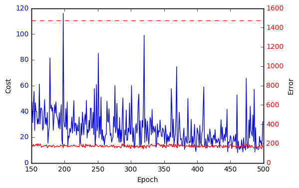

<!-- ## What is car dependency? -->

<!-- Car dependency should be easy to define: a measure of the extent to which people *depend* on their cars. -->
<!-- But what does this actually mean? -->
<!-- Unless your car doubles as a life-support system, it is unlikley that you literally depend on it for survival. -->
<!-- More likely you depend on the car for trips that are *seen as essential*, for modern life. -->
<!-- Whether it's for doing the 'weekly shop', dropping children off at school or taking a sick relative to hospital at an affordable, car use can easily become integral modern life. -->

<!-- Of course, each of these trips could have either been made by a different mode or not made at all and (except potentially in the case of taking a relative to hospital) nobody would die. -->
<!-- Car dependency is thus about observed behaviour than hypothetical consequences of going *cold turkey*. -->
<!-- The analogy of a drug dependency is useful. -->
<!-- Drug dependents will not die if they can no longer indulge their addition. -->
<!-- But life will be hard, at least for a while after, when they stop. -->
<!-- Similarly, those who are car dependent will find it hard to adjust to life after their car has been taken away. -->

<!-- From a policy perspective car dependency is problematic due to its negative consequences, not in its own right.  -->
<!-- Notwithstanding questions of whether government policy encourages car dependency,  -->


<!-- It is important to note that car dependency is not necessarily  -->

<!-- ## Established methods for car dependency research -->

<!-- There is a long history of reasearch into the concepts of car dependency and, more broadly, mode choice.  -->


<!-- [@mogridge_self-defeating_1997] -->


## Introduction

The primary purpose of this project is to show the power and potential benefits of machine learning algorithms in analysing transport data. By demonstrating previously impossible or inaccessible methods we aim to show how new techniques, combined with new and newly open datasets, can generate a strong evidence base for transport planning and policy. The aspiration is that the work will filter into policies, to make them data-driven, transparent, reproducibible and encouraging of citizen science and innovation.

It is well-known that car dependency is close to the root of many problems that are exacerbated by the transport system, economic, environmental and social. However, car dependency is a complex phenomena linked to multiple interrelated factors, the root causes of which are not well understood. This makes it an ideal topic for investigation by machine learning. Therefore, beyond the methodological insights gained by this project, we hope that the results lead to policies that are more evidence-based and effective that decisions based on basic indicators, intuition, and experience alone.

During the first month-and-a-half of the project (2017-02-06 to 2017-03-20) we have spent the majority of the time accessing and organising the data, exploring cutting edge methods in machine learning and researching the literature on car dependency. This **first Progress Report** focuses on the input data, the vital raw material for machine learning algorithms to work. First, however, it is worth considering what is actually meant by car dependency in the context of machine learning, which depends on a categorical or (more frequently) quantitative dependent variable which we are seeking to understand.

## Definition of car dependency

There are many possible ways of defining and measuring car use. In this work we interpret car dependency as more about current behaviour than hypothetical future behaviours. Specifically, we define car dependency as:

> The proportion of people in a zone or along a particular desire line who drive, or are passengers in a car or van, as their main mode of transport, taking account of the distances of those trips.

By 'taking account of the distances of those trips' we mean that a zone in which 50% of the population use a car for trips of 5 miles is more car dependent than a zone in which 50% of the population uses a car for trips of 20 miles. We define car dependency *relative to distance* because the policy motivation of this project is to help identify zones and routes where interventions could reduce car dependency. It is easier to intervene to reduce car use for 5 mile trips (e.g. by providing good walking and cycling facilities) than for 20 mile trips (e.g. by creating new bus routes or public transport stations).

<!-- Say how we define car dependency, and something about the model used to estimate 'expected level of driving' here please. -->

## Input data

For simplicity and maximum accessibility this project uses only datasets which are open (publicly available). There are three main input dataset types:

- Origin-destination (OD) commute data from the 2011 Census data.
- Geographically aggregated socio-demographic data from the 2011 Census.
- Geographic variables associated with each OD pair.

The Census was used as the primary input dataset because it provides so many variables relevant to car dependency. To our knowledge, the breadth of input datasets have never been analysed together in a single project.

The case study region used for this project was **West Yorkshire**. This case study was selected due to the wide range of social and geographical environments linked to car dependency found here: it includes rural, urban, deprived and privaledged areas.

### Origin-destination data

The fundamental input dataset was a table reporting the number of people travelling, by main mode of transport, commuting to work between Middle-Super Output Areas (MSOAs, average population: ~7,500). This is an open dataset ([available online from the official WICID data portal](http://wicid.ukdataservice.ac.uk/)) (dataset WU03EW). The file was downloaded as `wu03ew_v2.zip`, an 11.8 MB zipfile which when unzipped creates the file 109 MB plain text file `wu03ew_v2.csv`, read-in with the following command:

```{r, eval=FALSE}
odall = readr::read_csv("data/wu03ew_v2.csv")
```

The result is a data frame the first two columns of which contain a the code for the MSOA of origin and destination, respectively. The subsequent columns report number of people whose main mode of travel to work was:

- work at home (no transport used)
- some form of metro
- train
- bus or coach
- taxi
- motorcycle or scooter
- drive a car or van
- passenger in car or van
- bicycle
- walk
- other

We grouped together people who drive or are passengers to estimate car dependency. Further, we filtered out flows with an origin or destination outside West-Yorkshire, resulting in **53,807** OD pairs in the study region. This amount of data is sufficient for machine learning algorithms to work and extract complex insights, but small enough for experimentation and fast iteration of methods.

To convert the non-geographical OD dataset into geographic data we used the function `od2line()` from the **stplanr** R package. The result is straight lines that can be plotted on the map and about which geographical variables, such as proximity to motorways, can be extracted. 

<!-- Maybe add example code here. -->

```{r, echo=F, out.width="49%", fig.show='hold', fig.cap="A sample of work commute flows in the West Yorkshire region (left), and a sample of the result of the code which calculates the distance between motorways (red) and flows (black), in this case discarding all flows within a certain distance of the motorway, as an example."}
knitr::include_graphics(c("../figures/flows_500_westyorkshire.png", "../figures/dist_motorways.png"))
```

We will hereon refer to each home-work (origin-destination) pair and its corresponding number of commuters, in geographic form, as a *flow* (see Figure 1). 

To this base table there are two ways to further increase the data included for modelling: the Census provides numerous other demographic and economic measures and indicators which can be linked to the commuter's home MSOA ([available here](https://www.nomisweb.co.uk/census/2011/data_finder)), and it also provides workplace data which a group of researchers at the University of Southampton have conveniently created a classification of (by work type, [available online as well](http://cowz.geodata.soton.ac.uk/download/)) which can be linked to the workplace MSOA.

### Socio-demographic data

The geodemographic data relevant to each origin (home) MSOA which was deemed relevant and annexed to the flows data consists of the following variables: number of people in particular age brackets, number of people of each gender, car or van availability (including number of homes with 0,1,2,etc. cars), population density, number of economically active and inactive people, general health (number of people with very good, fair, etc. general health), number of people per ethnicity group, number of people by maximum qualification level, and lastly, average number of rooms, bedrooms and fraction of homes with central heating.

In addition to this we included the workplace zone classification which assigns each destination MSOA (workplace) to one of the following groups:

```{r wzclasstable, echo=FALSE, message=FALSE}
df = readr::read_csv(
'Workplace zone classification, Code
                         Retail,1
                       Top jobs,2
                  Metro suburbs,3
              Suburban services,4
 Manufacturing and distribution,5
                          Rural,6
            Servants of society,7
'
)
knitr::kable(df, caption="The classification of workplace zones.")
```

### Spatial data

In addition to this Census data we gathered and computed spatial data as well. We have obtained the location of motorways through the [OSM API](https://osmdatar.github.io/osmdata/articles/osmdata.html), and the positions of train stations, coach stations, and bus stops from the [NAPTAN dataset](http://naptan.app.dft.gov.uk/datarequest/help). This allowed us to calculate geographical distances between flow lines and motorways, train stations, coach stations, and bus stops. This proximity and accessibility data is arguably vital to best understand and model car usage propensity, and has for the first time become readily available via the OSM platform, and analysis of the type we aim to do next should be cutting-edge data analysis.

\newpage

### Overview of input data

A list of the variables used in the input dataset for the machine learning algorithms is provided below.

```{r variablestable, echo=F, message=FALSE}
df = readr::read_csv("../Table_of_variables.csv")
df$Description = strtrim(df$Description, width = 78)
knitr::kable(df, caption="The variables in the full dataset.")
```

\newpage

## Preparing the target variable: removing distance-dependence

From the outset one can foresee that out of our dataset one of the most important variables in predicting car dependency will be the distance between the origin (home MSOA) and the destination (workplace MSOA). However given our stated aim of better understanding the driving factors behind car dependency for policy decision-making purposes, distance is not something we can alter by policy and it is therefore of secondary interest, as mentioned in our definitioni of car dependency above. In order to prevent our models from focussing on distance dependence we would therefore like to remove the distance-dependence of the car fraction data as best as possible.

We do this by using a model to fit the distance dependence of the car fraction, ensuring it has a good fit to the data, and then subtracting from the observed car use fractions the car use predicted by the model. The result of this is a variable which has a much diminished distance-dependence, and it is this variable which we will then apply machine learning to model in the next stage.

The model which best fit how the car use fraction varies with distance turned out to be a logistic regression model fit on the mean car fraction by 1km distance band (i.e. a curve where the first point is the average car use fraction for distances of 0-1km, etc.) using the distance and the natural logarithm of the distance as input variables (Figure 2).

After subtractin the car fraction predicted by the model from the observed car fraction we obtain a variable which a much reduced dependence on distance (i.e. it is centred on zero and does not significantly increase or decrease with distance), as shown in Figure 3.

Now that we have approximately removed the dominant influence of the distance, we can proceed to use machine learning to tease out the patterns in the data from all the other more subtle variables. 

```{r, echo=F, out.width="49%", fig.show='hold', fig.cap="The model fit obtained for car useage fraction as a function of distance. The fit against the mean by distance band is shown on the left, and the fit against all data points is shown on the right."}
knitr::include_graphics(c("../figures/dist_fit_mean.png", "../figures/dist_fit.png"))
```


```{r, echo=F, out.width="49%", fig.show='hold', fig.align='center', fig.cap="The variable obtained by subtracting predicted car fraction from observed car fraction."}
knitr::include_graphics("../figures/response.png")
```

\newpage

<!-- ## Next steps -->

<!-- Based on the input data documented in the previous sections, we have already made a start on developing and running code to identify the variables associated with car dependency. To do this we will perform model selection of a wide range of machine learning regression models, checking their performance in prediction car dependency (car use fraction as defined above) on a new dataset. -->

<!-- Once the best-performing model has been found we will do some model validation to ensure the model gives sensible predictions on new data, and then proceed to attempt to extract which variables the model deems most important in predicting car dependency, in general, or if possible also for individual predictions. -->


## Machine Learning

Now that we have prepared an appropriate response variable with distance-dependence approximately removed (and 1-inflated values also helpfully transformed to continuous lower values in the process) we can begin to fit both linear and non-linear statistical and machine learning models to predict the response variable based on the wealth of geodemographic and spatial covariates we have gathered.

The first step in this process is that of model selection by cross-validation, and it is this procedure which we will now describe. The first step of model selection is to choose the metric of interest, based on which we will select the best-performing model. Given that this is a regression problem there are multiple possible metrics: mean squared error (MSE), mean absolute error, coefficient of determination ($R^2$), etc. From the point of view of policy decision-making, which is our ultimate goal, there is no clear choice of best-suited metric. We have chosen the coefficient of determination as it seems to be the metric of interest for our Data Science contact at the Department for Transport, but it must be noted that this metric is ill-suited for the mostly non-linear [^1] regression models we consider (see for example [@spiess2010evaluation]).

[^1]: For clarity, we are referring to non-linearity in the regression parameters, models non-linear in the covariates (e.g. the Elastic Net model we use) are still linear by this definition.

Having chosen the metric of interest, we proceed to shuffle and split the data in preparation for cross-validation. Flows are unordered data and therefore can be shuffled uniformly with no problem. We shuffle the flows in the West Yorkshire dataset, and then split off half of the data for model selection and validation, the other half is left for final model testing to estimate the generalisation error (or parts of it may used for further model selection, e.g. parameter tuning, if needed).

We then perform 10-fold cross-validation on the validation half of the dataset. At this point we do not perform any hyperparameter tuning and use the default parameters set in scikit-learn's implementation [@scikit-learn] of these algorithms[^2]. The regression models considered and the result of the model selection are shown in the table below.

[^2]: Grid search or random search hyperparameter tuning by cross-validation could be carried out at a later date on a separate dataset for a subset of the selected models to extract further gains in predictive performance.

```{r modelseltable, echo=FALSE, message=FALSE}
df = readr::read_csv(
'Model, $R^2$
XGBoost, 0.18683495340829917
 ElasticNetCV, 0.14689197361179665
 TheilSen, 0.12264099250943154
 Multi-LayerPerceptron, 0.096875782382435549
 RandomForest, 0.078340325161809443
 KNeighbors, 0.040983543493443464
 ExtraTrees, 0.032621071535337588
 --MEAN MODEL--, 0.0
 Dummy, -0.00010168044681220974
 PassiveAggressive, -0.57304780004802169
 DecisionTrees, -0.64736807548249409
 RANSAC, -1.1436804189325766e+22
 SGD, -1.5174384327981293e+26
'
)
knitr::kable(df, caption="10-fold cross-validation $R^2$ scores of the the regression models considered. The `MEAN MODEL` is a model which always predicts the mean of the response variable, and is included as a reference point and benchmark. The RANSAC and Stochastic Gradient Descent (SGD) regressors have clearly not converged but we will not attempt to tune them for now. ")
```

Without engaging in extensive hyperparameter tuning on a separate dataset, we see that the XGBoost regressor [@Chen:2016:XST:2939672.2939785] outperforms the rest of the models by a significant margin, with $R^2 \approx 0.18$. We will therefore select it as a tentative final model and now proceed to perform some model validation to ensure its predictions are sensible.


### Model validation

For a regression task such as the one at hand, the model validation checks which can be performed are perhaps less intuitive than the tests available for classification tests. However some basic plots of the model's predictions and checks of the model's residuals and the correlation of the model's predictions with observed values can and should be carried out.

The figure below shows the residuals of the XGBoost regressor on a validation dataset, showing no obvious trend or asymmetry which would be indicative of a poorly-fit model.

```{r, echo=F, out.width="49%", fig.show='hold', fig.align='center', fig.cap="The residuals of the XGBoost regressor on a validation dataset."}
knitr::include_graphics("../figures/xgb_residuals.png")
```

We can further inspect the distribution and correlation of the predicted and observed values, as well as a histogram of their distribution.

```{r, echo=F, out.width="49%", fig.show='hold', fig.align='center', fig.cap="The distribution and correlation of predictions and observed values."}
knitr::include_graphics(c("../figures/xgb_pred_obs_correlation.png", "../figures/xgb_hist.png"))
```


### A Deep Learning model

For completeness, we would be remiss if we did not consider fitting a deep learning model. We have constructed a 3-hidden layer Multi-Layer Perceptron (MLP) using the Theano [@2016arXiv160502688T] Python package. The MLP implementation in scikit-learn includes only a single hidden layer, therefore there is value in exploring potential predictive performance gains by considering deeper neural networks.

Numerous contemporary training methods were implemented to enable the successful training of this neural network, including: orthogonal weight initialisation [@2013arXiv1312.6120S], dropout regularisation [@srivastava2014dropout], $L_1$ and $L_2$ regularisation, ReLu activation units, etc. This allowed the neural network to be properly fit over hundred of epochs (passes over the training data), with no sign of significant overfitting, as shown in the training and validation errors in the figure below.

```{r, echo=F, out.width="49%", fig.show='hold', fig.align='center', fig.cap="The training error and validation set errors as training of the MLP progresses."}

```

A deep learning model was therefore successfully fit, with a sensible residual plot and distribution of predictions. However its performance was still below that of the XGBoost regressor previously selected, with a coefficient of determination of $R^2 \approx 0.136$, and a Pearson correlation between predicted and observed values of 0.37. One may speculate that with larger training datasets (e.g. a good fraction of the flows in England), this model may dominate. However with the limited training set of part of West Yorkshire, XGBoost remains dominant.


### Interpretable analysis

Thus far we have selected and validated a model which maximises a metric of predictive performance. Should we be interested purely in predictive purposes this is the best model to consider from our analysis thus far. However from a policy perspective the goal is perhaps only partly predictive accuracy (which is of value when considering counterfactual scenarios for future projects, e.g. given the data we have on known flows on particular roads, how heavy a flow can we expect on a hypothetical new road with certain features), but also reliant on gaining a data-driven understanding of the factors which most heavily influence car commuting flows. To this end we must extract interpretable insights from the predictive machine learning models we have fit.

A noteworthy caveat to always be kept in mind when we attempt to extract interpretable knowledge from machine learning models is that the particular set of variables highlighted as most important in making accurate predictions are as much a function of the model itself as they are of the data. Therefore no single set of important features extracted from a single model should be taken without undue caution. Ideally, one may approach the problem as one of consensus, where variables selected by multiple models (each significantly algorithmically different from the rest) would have a stronger evidence-base to claim variable importance.

The simplest visual approach to gauging variable importances is to fit a shallow decision tree, such as the one shown in the figure below.

```{r, echo=F, out.width="60%", fig.show='hold', fig.align='center', fig.cap="A decision tree fit on the West Yorkshire training data. X is the training data matrix with X[i] denoting its i-th column as the variable that split has been based on."}
knitr::include_graphics("../figures/decision_tree.png")
```

However decision trees yielded a very poor fit during model selection (see table above), so this gives perhaps a suboptimal understanding of variable importances.

Another tree-based approach however gave much better predictive performance, and can also yield a measure of variable importances based on how often a particular variable was used to create splits in the model's trees: a Random Forest regressor. Extracting variable importances from a Random Forest regressor fit on the training set gives the variable importances shown in the figure below.

```{r, echo=F, out.width="60%", fig.show='hold', fig.align='center', fig.cap="Variable importances from a Random Forest model."}

```

A different, linear, model which yielded decent predictive performance and which is interpretable, is the Elastic Net regression model we fit as part of the model selection. The regression coefficients of this model give both a measure of variable importances, as well as directionality of their effect, as shown in the table below.

```{r elastictable, echo=FALSE, message=FALSE}
df = readr::read_csv(
'Variable, Coefficient
house0carpct, -0.054776752111173117
 16-24, -0.039986717012222166
 house2carpct, 0.02339319715616801
 wzclass, 0.019279327583230203
 distmway, -0.015871861339193081
 bhealth, 0.015295607154651067
 female, -0.014358661391721107
 black, -0.014144458679228858
 fhealth, 0.0082149141041497377
 noqual, -0.0077581268478576059
 vbhealth, 0.0072882827055536182
 mixed, 0.0070850099027320382
 otherethn, -0.0062778655952986633
 econactivpct, -0.0052560597618020542
 lev2qual, 0.0046241045861757542
'
)
knitr::kable(df, caption="The regression coefficients of the Elastic Net model, ordered by descending absolute value.")
```

We have also considered the Boruta [@kursa2010boruta] feature selection algorithm, which is based on Random Forest regressors to yield the following set of important variables:  
['16-24', 'female', 'house0carpct', 'house2carpct', 'disttrainstn', 'distcoachstn', 'distbusstop', 'distmway']

The top 10 variables by importance according to the Elastic Net regressor, the Random Forest model, and the 8 variables identified by the Boruta algorithm are therefore as follows:  
{'16-24', 'house2carpct', 'bhealth', 'black', 'noqual', 'distmway', 'fhealth', 'house0carpct', 'female', 'wzclass'}  
{'16-24', 'house2carpct', 'distcoachstn', 'disttrainstn', 'distmway', 'house0carpct', '35-49', 'female', 'wzclass', 'distbusstop'}  
{'16-24', 'house2carpct', 'distcoachstn', 'disttrainstn', 'distmway', 'house0carpct', 'female', 'distbusstop'}  

Choosing the common subset of these variables as the set of variables on which we have a strong consensus evidence-base of their importance, we therefore come to the following set of variables, which we conclude have a heavy influence on predicting the response variable:  
  
**{'16-24', 'distmway', 'female', 'house0carpct', 'house2carpct'}**


#### Interpretability of individual predictions

So far we have focussed on extracting the set of variables which are globally important in predicting the response variable. However often what is of interest is being able to extract some understanding of why individual predictions have been made. To this end we have included the recently devised LIME algorithm [@ribeiro2016should] as implemented by one of the authors of the paper and made [available online](https://github.com/marcotcr/lime).

A typical 'explanation' for a given prediction then looks as follows:  
[('16-24 <= -0.55', 0.12533686475591391),
 ('house2carpct > 0.75', 0.10773776968620975),
 ('female <= -1.27', 0.050245894104752331),
 ('centheat > 0.84', 0.043881786916929157),
 ('house0carpct <= -0.74', 0.039521388171645959),
 ('house3carpct > 0.73', 0.027131249833026956),
 ('wzclass > 0.60', -0.02432970045350389),
 ('75+ <= -0.09', 0.021833461847929985),
 ('-0.18 < vghealth <= 0.52', 0.020612773246808588),
 ('-0.62 < otherqual <= -0.35', -0.017353392810289966),
 ('distcoachstn <= -0.67', -0.015832260353557698),
 ('lev1qual <= -0.48', 0.015421096750167514),
 ('disttrainstn <= -0.68', -0.011242940585556988),
 ('otherethn <= -0.57', 0.0099682100686187616),
 ('35-49 <= -1.16', 0.0098627230705988691)]
 
 The reliability, interpretation, and further uses of the LIME algorithm in our present case study remain to be fully examined, but its potential is clear.


# References